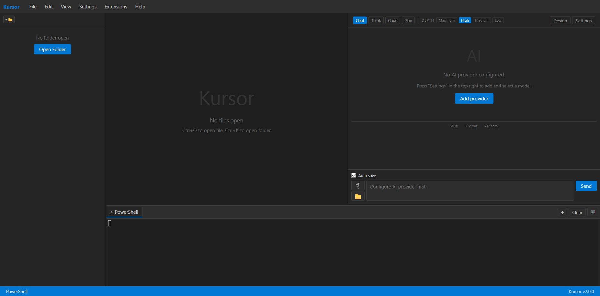

# Kursor — AI teksta redaktors / AI Text Editor / ИИ-текстовый редактор

**LV:** Kursor ir profesionāls teksta redaktors ar mākslīgā intelekta atbalstu. Iebūvēts Monaco redaktors (tas pats, kas VS Code), MI čats ar 50+ provideriem, terminālis, HTML dizaina ģenerators un pārlūka kontrole.

**EN:** Kursor is a professional text editor with AI support. Built-in Monaco editor (same as VS Code), AI chat with 50+ providers, terminal, HTML design generator, and browser control.

**RU:** Kursor — профессиональный текстовый редактор с поддержкой ИИ. Встроенный редактор Monaco (как в VS Code), ИИ-чат с 50+ провайдерами, терминал, генератор HTML-дизайнов и управление браузером.

---

## 📸 Screenshots




---

## ✨ Features / Iespējas / Возможности

| LV | EN | RU |
|----|----|-----|
| ✅ Monaco redaktors ar sintakses izcelšanu | ✅ Monaco editor with syntax highlighting | ✅ Редактор Monaco с подсветкой синтаксиса |
| ✅ MI čats (Chat, Think, Code, Plan) | ✅ AI chat (Chat, Think, Code, Plan) | ✅ ИИ-чат (Chat, Think, Code, Plan) |
| ✅ 50+ MI provideru (OpenAI, Anthropic, DeepSeek, u.c.) | ✅ 50+ AI providers (OpenAI, Anthropic, DeepSeek, etc.) | ✅ 50+ ИИ-провайдеров (OpenAI, Anthropic, DeepSeek и др.) |
| ✅ Iebūvēts terminālis | ✅ Built-in terminal | ✅ Встроенный терминал |
| ✅ HTML dizaina ģenerators | ✅ HTML design generator | ✅ Генератор HTML-дизайна |
| ✅ Pārlūka kontrole (ar atļaujām) | ✅ Browser control (with permissions) | ✅ Управление браузером (с разрешениями) |
| ✅ Proxy/VPN atbalsts | ✅ Proxy/VPN support | ✅ Поддержка Proxy/VPN |
| ✅ MCP serveru atbalsts | ✅ MCP server support | ✅ Поддержка MCP-серверов |
| ✅ Dark/Light tēma | ✅ Dark/Light theme | ✅ Тёмная/светлая тема |
| ✅ 3 valodas (LV/EN/RU) | ✅ 3 languages (LV/EN/RU) | ✅ 3 языка (LV/EN/RU) |

---

## 🖥️ Supported platforms / Atbalstītās platformas / Поддерживаемые платформы

| Platform | x64 | ARM64 | x86 |
|----------|:---:|:-----:|:---:|
| Windows 10+ | ✅ | ✅ | ✅ |
| macOS 11+ | ✅ | ✅ | — |
| Linux (GTK3) | ✅ | ✅ | ✅ |

---

## 🚀 Installation / Instalācija / Установка

Download latest release from [Releases](https://github.com/Juris55/Kursor/releases) page.

## 🔧 Dev setup / Izstrādes iestatīšana / Настройка разработки

```bash
git clone https://github.com/Juris55/Kursor.git
cd Kursor
npm install
npm run electron:dev
```

---

## 📦 Build for distribution / Buildošana / Сборка

```bash
# Windows
npm run electron:build:win     # x64
npm run electron:build:win:arm # ARM64
npm run electron:build:win:x86 # x86

# macOS (must build on macOS)
npm run electron:build:mac     # Intel
npm run electron:build:mac:arm # Apple Silicon

# Linux (must build on Linux)
npm run electron:build:linux     # x64
npm run electron:build:linux:arm # ARM64
npm run electron:build:linux:x86 # x86
```

---

## 🤝 License / Licence / Лицензия

MIT
